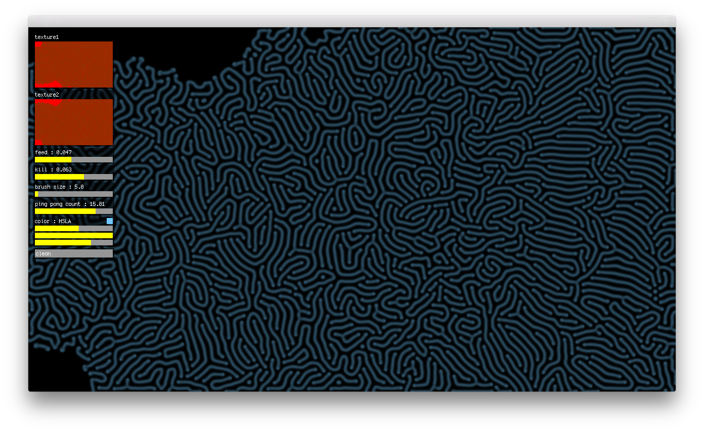

# GrayScott on GPU

Original implementation by [pmneila](https://github.com/pmneila) - [jsexp](https://github.com/pmneila/jsexp), simplified and adapted for [pex](http://vorg.github.io/pex/).

<p align="center"></p>

## Installation

```
git clone ...
npm install
```

## Usage

```
npm start   # run in plask
npm run web # run in browser
```

